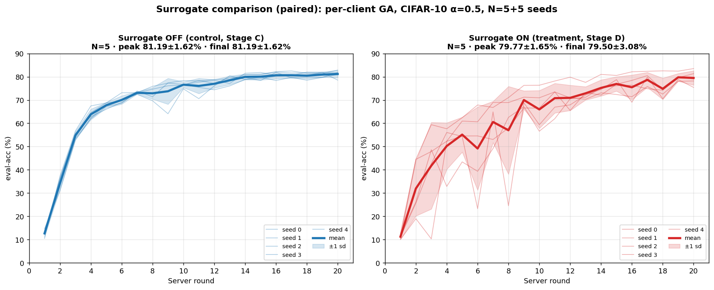

# Surrogate comparison (paired): with vs without surrogate

**Setup**: 5 seeds × 2 variants (surrogate ON vs OFF) of per-client GA on CIFAR-10, Dirichlet α=0.5, 20 rounds. Only `ENABLE_SURROGATE_GA` differs.

## 1. Peak eval-acc

| Variant | N | Mean (%) | SD (%) | CI95% ± (%) | Median (%) | IQR (%) | Min–Max (%) |
|---|---:|---:|---:|---:|---:|---:|---:|
| Surrogate OFF (control) | 5 | 81.94 | 0.68 | 0.84 | 81.91 | 0.11 | 80.97–82.89 |
| Surrogate ON (treatment) | 5 | 80.69 | 1.96 | 2.43 | 80.49 | 1.44 | 78.19–83.52 |

**Δ (OFF − ON) = +1.25 pp** · Mann-Whitney U = 19.0, p = 0.2222 (two-sided, exact)

## 2. Final eval-acc (round 20)

| Variant | N | Mean (%) | SD (%) | CI95% ± (%) | Median (%) | IQR (%) | Min–Max (%) |
|---|---:|---:|---:|---:|---:|---:|---:|
| Surrogate OFF (control) | 5 | 81.19 | 1.62 | 2.02 | 81.61 | 0.94 | 78.56–82.89 |
| Surrogate ON (treatment) | 5 | 79.50 | 3.08 | 3.83 | 79.02 | 3.15 | 75.43–83.52 |

**Δ (OFF − ON) = +1.69 pp** · Mann-Whitney U = 17.0, p = 0.4206 (two-sided, exact)

## 3. Wall-time

| Variant | N | Mean (min) | SD (min) | Min–Max (min) |
|---|---:|---:|---:|---:|
| Surrogate OFF (control) | 5 | 114.2 | 3.1 | 110.1–117.8 |
| Surrogate ON (treatment) | 5 | 63.8 | 1.7 | 61.6–66.4 |

**Δ wall (OFF − ON) = +50.4 min** · ratio OFF/ON = **1.79×** · Mann-Whitney U = 25.0, p = 0.0079

## 4. Per-seed peak (paired)

| Seed | OFF peak (%) | ON peak (%) | Δ (OFF−ON) pp |
|---:|---:|---:|---:|
| 0 | 82.89 | 78.19 | +4.70 |
| 1 | 80.97 | 83.52 | -2.55 |
| 2 | 81.91 | 79.90 | +2.01 |
| 3 | 82.02 | 81.34 | +0.68 |
| 4 | 81.91 | 80.49 | +1.42 |

**Wilcoxon signed-rank (paired by seed)**: W = 4.0, p = 0.4375

## 5. Catastrophic crashes (Δeval-acc < -10pp in 1 round)

- **Surrogate ON (treatment, Stage D) · seed 2**: R6 (−31.1pp), R8 (−40.3pp)
- **Surrogate ON (treatment, Stage D) · seed 3**: R4 (−15.8pp), R10 (−10.5pp)

## 6. Plot

