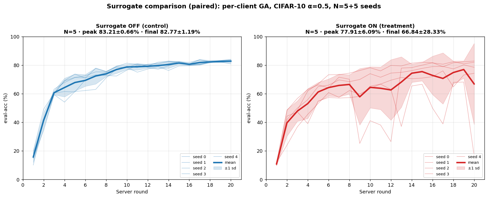

# Surrogate comparison (paired): with vs without surrogate

**Setup**: 5 seeds × 2 variants (surrogate ON vs OFF) of per-client GA on CIFAR-10, Dirichlet α=0.5, 20 rounds. Only `ENABLE_SURROGATE_GA` differs.

## 1. Peak eval-acc

| Variant | N | Mean (%) | SD (%) | CI95% ± (%) | Median (%) | IQR (%) | Min–Max (%) |
|---|---:|---:|---:|---:|---:|---:|---:|
| Surrogate OFF (control) | 5 | 83.21 | 0.66 | 0.81 | 82.83 | 1.03 | 82.66–84.07 |
| Surrogate ON (treatment) | 5 | 77.91 | 6.09 | 7.57 | 80.15 | 6.40 | 68.16–82.88 |

**Δ (OFF − ON) = +5.30 pp** · Mann-Whitney U = 22.0, p = 0.0556 (two-sided, exact)

## 2. Final eval-acc (round 20)

| Variant | N | Mean (%) | SD (%) | CI95% ± (%) | Median (%) | IQR (%) | Min–Max (%) |
|---|---:|---:|---:|---:|---:|---:|---:|
| Surrogate OFF (control) | 5 | 82.77 | 1.19 | 1.47 | 82.83 | 0.74 | 80.89–84.07 |
| Surrogate ON (treatment) | 5 | 66.84 | 28.33 | 35.17 | 78.48 | 7.79 | 16.53–82.88 |

**Δ (OFF − ON) = +15.93 pp** · Mann-Whitney U = 21.0, p = 0.0952 (two-sided, exact)

## 3. Wall-time

| Variant | N | Mean (min) | SD (min) | Min–Max (min) |
|---|---:|---:|---:|---:|
| Surrogate OFF (control) | 5 | 142.7 | 5.2 | 137.2–150.0 |
| Surrogate ON (treatment) | 5 | 63.7 | 1.7 | 62.5–66.2 |

**Δ wall (OFF − ON) = +79.0 min** · ratio OFF/ON = **2.24×** · Mann-Whitney U = 25.0, p = 0.0079

## 4. Per-seed peak (paired)

| Seed | OFF peak (%) | ON peak (%) | Δ (OFF−ON) pp |
|---:|---:|---:|---:|
| 0 | 84.07 | 80.15 | +3.92 |
| 1 | 83.76 | 82.88 | +0.88 |
| 2 | 82.73 | 82.38 | +0.35 |
| 3 | 82.83 | 68.16 | +14.67 |
| 4 | 82.66 | 75.98 | +6.68 |

**Wilcoxon signed-rank (paired by seed)**: W = 0.0, p = 0.0625

## 5. Catastrophic crashes (Δeval-acc < -10pp in 1 round)

- **Surrogate ON (treatment) · seed 1**: R9 (−45.0pp), R12 (−11.7pp)
- **Surrogate ON (treatment) · seed 3**: R13 (−25.9pp), R16 (−16.7pp), R17 (−11.1pp), R20 (−51.6pp)
- **Surrogate ON (treatment) · seed 4**: R18 (−11.2pp)

## 6. Plot

